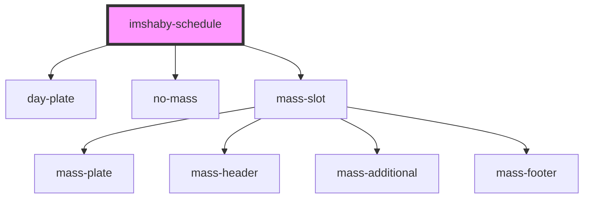

# imshaby-schedule

<!-- Auto Generated Below -->

## Properties

| Property   | Attribute   | Description | Type      | Default     |
| ---------- | ----------- | ----------- | --------- | ----------- |
| `expanded` | `expanded`  |             | `boolean` | `true`      |
| `parishId` | `parish-id` |             | `string`  | `undefined` |

## Dependencies

### Depends on

- [day-plate](../navs)
- [no-mass](../mass)
- [mass-slot](../mass)

### Graph

----------------------------------------------

*Built with [StencilJS](https://stenciljs.com/)*
