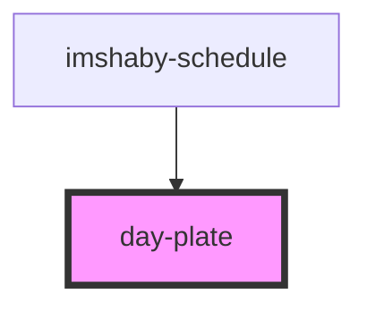

# day-plate

<!-- Auto Generated Below -->

## Properties

| Property   | Attribute  | Description | Type     | Default     |
| ---------- | ---------- | ----------- | -------- | ----------- |
| `active`   | `active`   |             | `string` | `undefined` |
| `aria`     | `aria`     |             | `string` | `'false'`   |
| `date`     | `date`     |             | `any`    | `undefined` |
| `day`      | `day`      |             | `any`    | `undefined` |
| `disabled` | `disabled` |             | `string` | `undefined` |
| `k`        | `k`        |             | `number` | `undefined` |

## Dependencies

### Used by

 - [imshaby-schedule](../imshaby-schedule)

### Graph

----------------------------------------------

*Built with [StencilJS](https://stenciljs.com/)*
